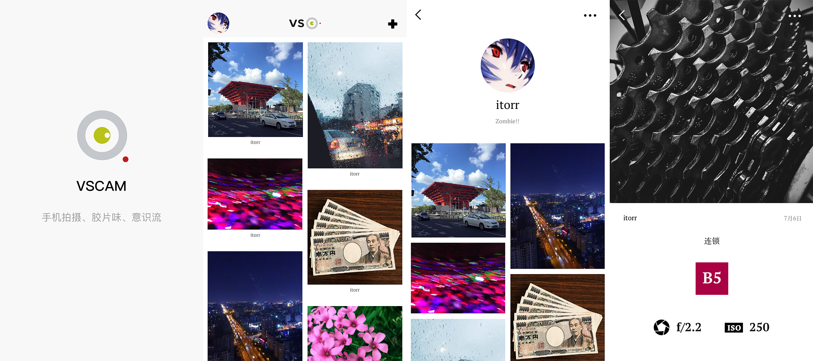

# VSCAM

VSCAM 是一款图片分享应用，此处为使用 Swift 编写的 iOS 版本，Android 版参见：[https://github.com/ayaseruri/vscam](https://github.com/ayaseruri/vscam)，更多信息请访问官网：[http://vscam.co/](http://vscam.co/)。

首页使用 UICollectionView 实现不同尺寸图片的瀑布流展示；  
发布页使用 Alamofire 实现了图片后台上传并且实时显示上传进度；  
图片详情页使用 UITableView 实现了类似 QQ 个人信息页面的背景图片拉伸效果；  
利用 MJPhotoBrowser 实现图片浏览功能；  
登录与注册页使用 UITableView 实现了焦点所在编辑框自动滚动到屏幕中心的效果；  
使用 ShareExtension 利用系统分享实现从浏览器页面打开 App 对应页面；  
使用 3D Touch 实现从剪贴板读取 URL 快速打开 App 内指定页面；  
集成 UMeng 与 Fabric 统计分析 SDK，可作为新手参考。

## AppStore

## 开发环境

- XCode 8.1+
- Swift 3.0.1+

## 构建

0. 首先，需要安装 [CocoaPods](https://github.com/CocoaPods/CocoaPods) 如果你没有安装的话；
1. 在终端中移动到当前工程根目录下执行 `pod install`；
2. 用 XCode 打开 VSCAM.xcworkspace；
3. 构建。

## 预览

 

 
