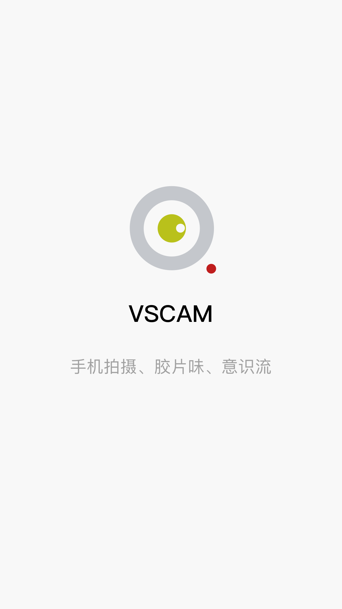
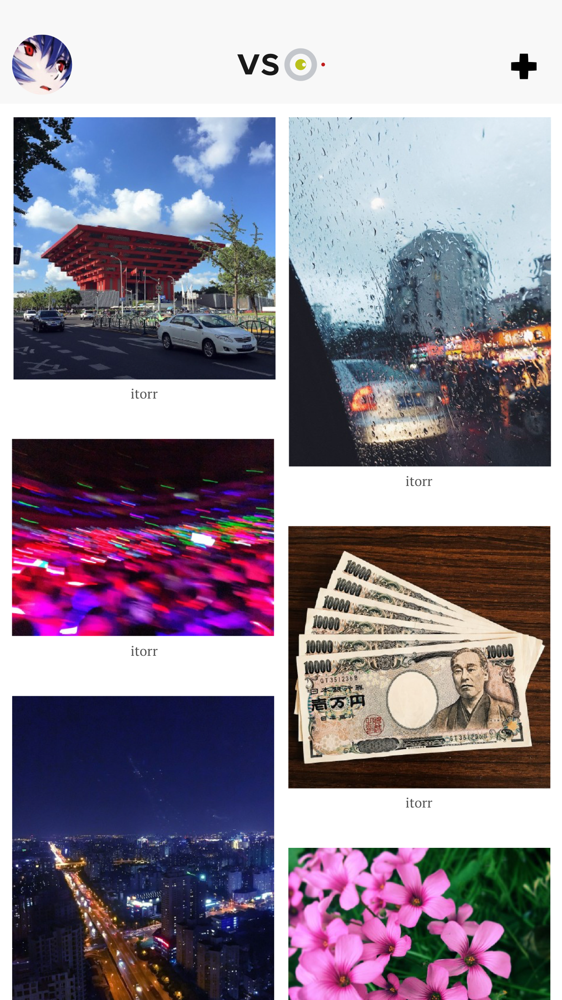
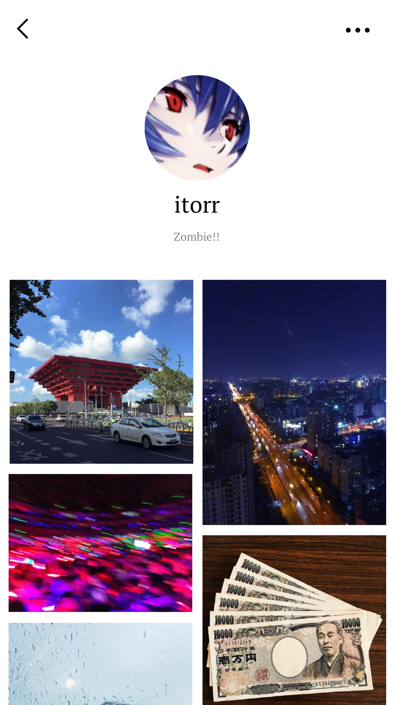
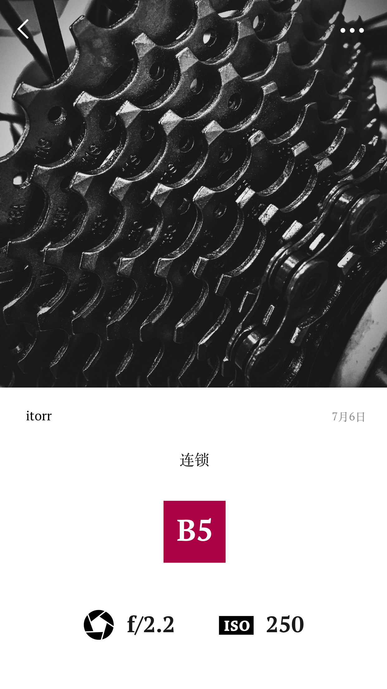

# VSCAM

VSCAM 是一款使用 Swift 编写的 iOS 图片分享应用，更多信息见官网 [http://vscam.co/](http://vscam.co/)。

首页使用 UICollectionView 实现不同尺寸图片的瀑布流展示；  
发布页使用 Alamofire 实现了图片后台上传并且实时显示上传进度；  
图片详情页使用 UITableView 实现了类似 QQ 个人信息页面的背景图片拉伸效果，同时利用 MJPhotoBrowser 实现图片浏览功能；  
登录与注册页使用 UITableView 实现了焦点所在编辑框自动滚动到屏幕中心的效果。  
集成 UMeng 统计分析SDK，可作为新手参考。

### 开发环境

- XCode 8.1
- Swift 3.1

### 构建

0. 首先，需要安装 [CocoaPods](https://github.com/CocoaPods/CocoaPods) 如果你没有安装的话；
1. 在终端中移动到当前工程根目录下执行 `pod install`；
2. 用 XCode 打开 VSCAM.xcworkspace；
3. 构建。

### 预览

